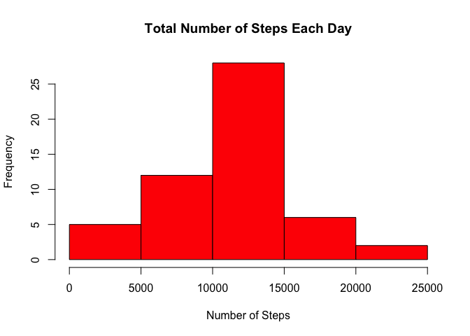
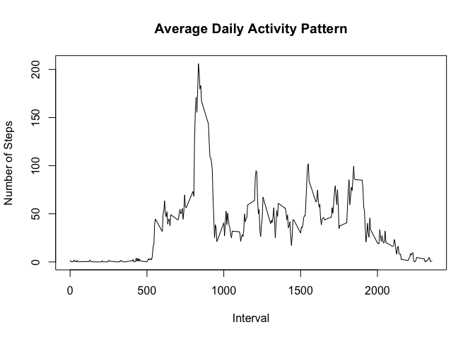
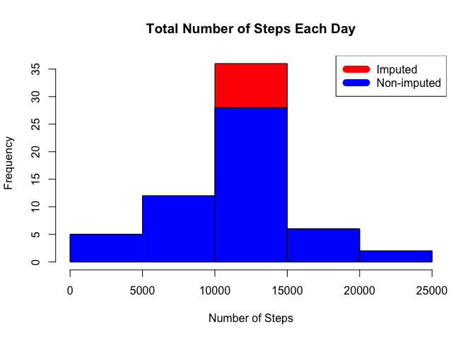
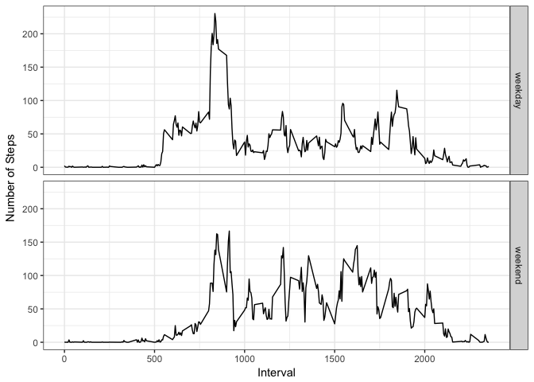

# Reproducible Research: Peer Assessment 1
## Introduction

This document presents the results of peer assessments 1 of course [Reproducible Research](https://class.coursera.org/repdata-004) on [coursera](https://www.coursera.org). This assignment makes use of data from a personal activity monitoring device. This device collects data at 5 minute intervals through out the day. The data consists of two months of data from an anonymous individual collected during the months of October and November, 2012 and include the number of steps taken in 5 minute intervals each day.

## Loading and preprocessing the data

The data for this assignment can be downloaded from the course web
site:

* Dataset: [Activity monitoring data](https://d396qusza40orc.cloudfront.net/repdata%2Fdata%2Factivity.zip) [52K]

The variables included in this dataset are:

* **steps**: Number of steps taking in a 5-minute interval (missing
    values are coded as `NA`)

* **date**: The date on which the measurement was taken in YYYY-MM-DD
    format

* **interval**: Identifier for the 5-minute interval in which
    measurement was taken

The dataset is stored in a comma-separated-value (CSV) file and there
are a total of 17,568 observations in this
dataset.

##### 1. Load the data


```r
wd <- getwd()
url <- "https://d396qusza40orc.cloudfront.net/repdata%2Fdata%2Factivity.zip"
f <- "activity.zip"
if (!file.exists(f)) {
    download.file(url, file.path(wd, f), method = "curl")
}
```
##### 2. Read the data


```r
if (!file.exists("activity.csv")) unzip("activity.zip")
activityData <- read.csv("activity.csv")
```
##### 3. Transform the data (if necessary) into a format suitable for the analysis


```r
activityData$date <- as.Date(activityData$date, format = "%Y-%m-%d")
activityData$interval <- as.factor(activityData$interval)
```


```r
str(activityData)
```

```
## 'data.frame':	17568 obs. of  3 variables:
##  $ steps   : int  NA NA NA NA NA NA NA NA NA NA ...
##  $ date    : Date, format: "2012-10-01" "2012-10-01" ...
##  $ interval: Factor w/ 288 levels "0","5","10","15",..: 1 2 3 4 5 6 7 8 9 10 ...
```
##### 4. Check the dimensions and a few rows of our data frame


```r
dim(activityData)
```

```
## [1] 17568     3
```

```r
head(activityData)
```

```
##   steps       date interval
## 1    NA 2012-10-01        0
## 2    NA 2012-10-01        5
## 3    NA 2012-10-01       10
## 4    NA 2012-10-01       15
## 5    NA 2012-10-01       20
## 6    NA 2012-10-01       25
```


## What is mean total number of steps taken per day?

##### 1. Make a histogram of the total number of steps taken each day

```r
total_steps_per_day <- aggregate(steps ~ date, activityData, sum, na.rm=TRUE)
hist(total_steps_per_day$steps, 
     main = paste("Total Number of Steps Each Day"), 
     col="red",
     xlab="Number of Steps")
```

<!-- -->

##### 2. Calculate and report the **mean** and **median** total number of steps taken per day

```r
mean(total_steps_per_day$steps)
```

```
## [1] 10766.19
```

```r
median(total_steps_per_day$steps)
```

```
## [1] 10765
```

## What is the average daily activity pattern?

##### 1. Make a time series plot (i.e. `type = "l"`) of the 5-minute interval (x-axis) and the average number of steps taken, averaged across all days (y-axis)

```r
total_steps_per_interval <- aggregate(steps ~ interval, activityData, mean, na.rm=TRUE)
total_steps_per_interval$interval <- 
    as.integer(levels(total_steps_per_interval$interval)[total_steps_per_interval$interval])
plot(total_steps_per_interval$interval,total_steps_per_interval$steps, 
     type="l", 
     xlab="Interval", 
     ylab="Number of Steps",
     main="Average Daily Activity Pattern")
```

<!-- -->

##### 2. Which 5-minute interval, on average across all the days in the dataset, contains the maximum number of steps?

```r
total_steps_per_interval$interval[which.max(total_steps_per_interval$steps)]
```

```
## [1] 835
```
The interval with most steps is 835

## Imputing missing values
##### 1. Calculate and report the total number of missing values in the dataset (i.e. the total number of rows with NAs)

```r
sum(is.na(activityData$steps))
```

```
## [1] 2304
```
Total Number of Missing values is 2304

##### 2. Devise a strategy for filling in all of the missing values in the dataset. The strategy does not need to be sophisticated. For example, you could use the mean/median for that day, or the mean for that 5-minute interval, etc.

Let's use the mean for the 5-minute interval

##### 3. Create a new dataset that is equal to the original dataset but with the missing data filled in.

```r
newActivityData <- activityData
for (i in 1:nrow(newActivityData)) {
    if (is.na(newActivityData$steps[i])) {
        interval <- newActivityData$interval[i]
        newActivityData$steps[i] <- total_steps_per_interval[total_steps_per_interval$interval==interval, "steps"]
    }
}
```

##### 4. Make a histogram of the total number of steps taken each day and Calculate and report the mean and median total number of steps taken per day.


```r
total_steps_per_day_imputed <- aggregate(steps ~ date, newActivityData, sum, na.rm=TRUE)

hist(total_steps_per_day_imputed$steps, 
     main = paste("Total Number of Steps Each Day"), 
     col="red",
     xlab="Number of Steps")

hist(total_steps_per_day$steps, 
     main = paste("Total Number of Steps Each Day"), 
     col="blue",
     xlab="Number of Steps",
     add = TRUE)
legend("topright", c("Imputed", "Non-imputed"), col=c("red","blue"), lwd=10)
```

<!-- -->


```r
mean(total_steps_per_day_imputed$steps)
```

```
## [1] 10766.19
```

```r
median(total_steps_per_day_imputed$steps)
```

```
## [1] 10766.19
```

**Do these values differ from the estimates from the first part of the assignment?**

```r
mean(total_steps_per_day_imputed$steps) - mean(total_steps_per_day$steps)
```

```
## [1] 0
```

```r
median(total_steps_per_day_imputed$steps) - median(total_steps_per_day$steps)
```

```
## [1] 1.188679
```
The mean is the same with variance 0 while the median has a small variance 1.1886792 between the total which includes the missing values to the base


**What is the impact of imputing missing data on the estimates of the total daily number of steps?**

According to the histogram result the impact of the missing data has the biggest effect on the 10000 - 150000 step interval and changes frequency from 27.5 to 35 a variance of 7.5

## Are there differences in activity patterns between weekdays and weekends?

##### 1. Create a new factor variable in the dataset with two levels -- "weekday" and "weekend" indicating whether a given date is a weekday or weekend day.

```r
newActivityData$day <- ifelse(weekdays(newActivityData$date) %in% c("Saturday", "Sunday"), "weekend", "weekday")
newActivityData$day <- as.factor(newActivityData$day)
weekend <- aggregate(steps ~ interval, 
                      data = newActivityData, 
                      FUN = mean, 
                      subset = newActivityData$day == "weekend", 
                      na.rm = TRUE)
weekend$day <- "weekend"

weekday <- aggregate(steps ~ interval, 
                     data = newActivityData, 
                     FUN = mean, 
                     subset = newActivityData$day == "weekday", 
                     na.rm = TRUE)
weekday$day <- "weekday"
newIntervalData <- rbind(weekend, weekday)
newIntervalData$day <- as.factor(newIntervalData$day)
newIntervalData$interval <- as.character(newIntervalData$interval)
newIntervalData$interval <- as.numeric(newIntervalData$interval)
```
##### 2. Make a panel plot containing a time series plot (i.e. type = "l") of the 5-minute interval (x-axis) and the average number of steps taken, averaged across all weekday days or weekend days (y-axis).

```r
library(ggplot2)
ggplot(newIntervalData, aes(interval, steps, group=1)) +
    geom_line() + 
    facet_grid (day~.) +
    labs(y = "Number of Steps") + 
    labs(x = "Interval") + 
    theme_bw()
```

<!-- -->

We can see that activity during weekends and weekdays are differenct from each other. During weekdays the peak activity in the morning between 7am and 9am. In contrast, during weekends activity data does not show a period with high level of activity and the activity remains higher than the weekday activity most of the time. Thus, during weekdays most of the people have high activity before work whereas during weekends people destribute there activity almost equaly because of plenty of free time.
